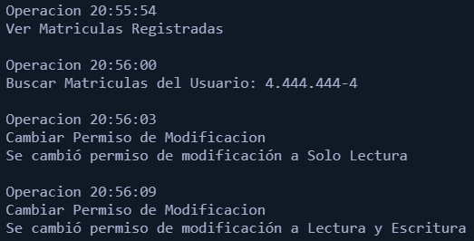
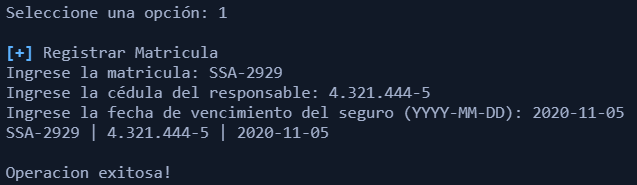
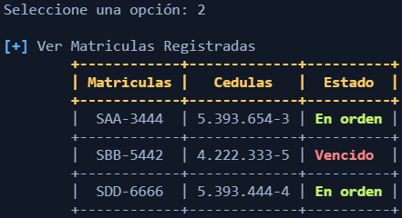
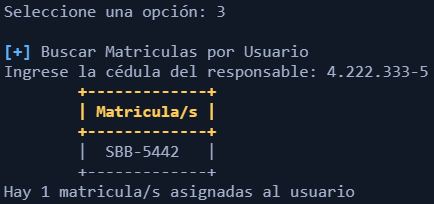
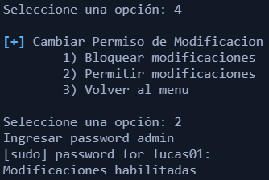

# README BASH

## Bash Scripting (10 Pts)

Deberá realizar un script de bash para la aseguradora ConductORT, se quiere que el gerente
de la zona de Montevideo, tenga la posibilidad de supervisar las operaciones de la empresa.
Se detallan las funcionalidades a continuación.

### Menú

Al ejecutar el script deberá mostrarse un menú de opciones.

Seguros ConductORT

1) Registrar Matricula

2) Ver Matrículas Registradas

3) Buscar Matrículas por Usuario

4) Cambiar Permiso de Modificación

5) Salir

Mediante el teclado, el usuario ingresa la opción deseada, en caso de no ser una opción válida
muestra “No es una opción válida”, este menú se repite luego de cada opción seleccionada
salvo la número 5.

Durante el uso de la aplicación se irá generando un log con lo realizado por el usuario durante
la ejecución del programa, se guardará en la subcarpeta logs relativa a la ubicación del script
de bash y cada ejecución genera un archivo log diferente con nombre único.

Salida de Ejemplo para un log dado:

### Opción 1 Registrar Matrículas

Lee las variables matricula, cedula y fecha.

Muestra primero el texto “Ingrese la matrícula” y la lee, luego “Ingrese la cédula del responsable” y lee, finalmente muestra “Ingrese fecha de vencimiento (YYYY-MM-DD)” y lee.

Condiciones:

- Se debe validar que la matrícula tenga el formato correspondiente a las matrículas de
Montevideo, en caso de no cumplirse muestra el mensaje “Matrícula inválida” y retorna
al menú.
- Se válida que el formato de la cédula sea el correcto, no es necesario validar el valor del
dígito verificador. En caso de no cumplirse se muestra “Cédula inválida” y retorna al
menú.

En caso de proseguir:

- Se guarda los datos recogidos, en el archivo “matriculas.txt” con el formato “Mátricula |
Cédula | Fecha” (La fecha puede guardarse en el formato que le resulte más
conveniente), el archivo se encuentra relativo a la carpeta donde se encuentra el script,
es decir se generará en el mismo directorio que esté.
- Se guardan estos mismos datos en el log correspondiente.
- Se Muestra “Operación exitosa”.
- Se regresa al menú principal.

Ejemplo de ejecución:

### Opción 2 Ver Matrículas Registradas

Mediante esta opción, debemos de analizar el archivo “matriculas.txt” y mostrar en pantalla,
cada línea del archivo con el formato “Matricula | Cédula | Estado del Seguro”, el estado puede
ser “Vencido” o “En orden”, dependiendo si la fecha guardada para esa matrícula es menor o
no a la fecha actual. Finalmente se regresa al menú principal

Condiciones:

- Se debe guardar en el log la consulta realizada

Ejemplo de salida:

### Opción 3 Buscar Matrículas por Usuario

Lee las variable cédula

Muestra primero el texto “Ingrese cedula a buscar ” y la lee, luego muestra:

- Cada matrícula asociada a la cédula en formato una matrícula por línea“
- Hay ____ matrículas asociadas al usuario” con la correspondiente cantidad en la zona
indicada

Condiciones:

- Se debe guardar en el log la cédula por la que se consultó

Ejemplo de ejecución:

### Opción 4 Cambiar Permiso de Modificación

Se pide cambiar los permisos del archivo matriculas.txt de solo lectura a lectura y escritura, o
viceversa según corresponda. Se debe pedir permiso sudo desde el script de bash y no previo
a su ejecución.

Entonces: Lee las variable opcion, y password
Muestra primero los textos “1)Bloquear Modificaciones” “2)Permitir Modificaciones” y la lee,
luego muestra “Ingrese contraseña de admin” y la lee, por último muestra “Modificación
realizada correctamente”

Ejemplo de ejecución:

Condiciones:

- Se debe guardar en el log “Se cambió permiso de modificación a ___" completando con
la opción correspondiente.
- Los permisos root para hacer esta operación deben de manera exclusiva ser pedidos
durante la ejecución del script, por el script. Es decir no se puede por ejemplo correr
desde antes con permisos root

### Opción 5 Salir

La opción 5 cierra el script.

Notas:

- Si el usuario ingresa a la opción 1 sin tener permisos de escritura se debe notificar que
la operación no será guardada.